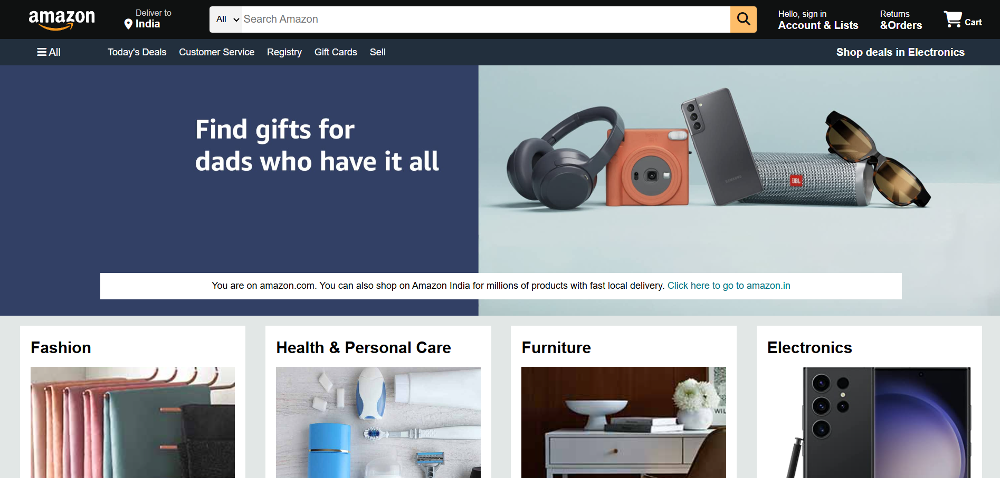
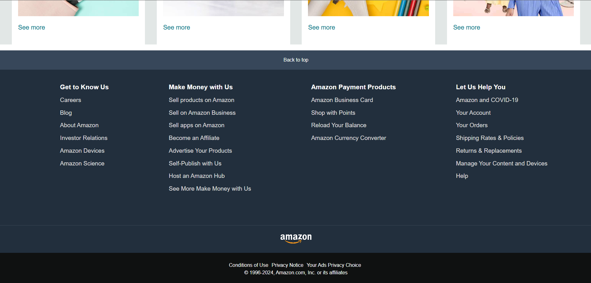

# Amazon Clone

A simple HTML and CSS clone of the Amazon website, designed to showcase basic web development skills. This project features a responsive layout, navigation, and product display sections, mimicking the aesthetics of the Amazon platform.

## Features

- **Responsive Design:** The layout adapts to different screen sizes for an optimal viewing experience.
- **Navigation Bar:** Includes links to various sections of the site.
- **Product Listings:** Displays a selection of products, each with an image and description.

## Technologies Used

- HTML
- CSS

## Getting Started

To view this project locally, follow these steps:

1. **Clone the Repository:**
   Open your terminal or Git Bash and run:
   ```bash
   git clone https://github.com/Saishhhhhh/Amazon-Clone.git
   
2. **Navigate to the Project Directory: Change to the project directory using:**
   ```bash
   cd Amazon-Clone

3. **Open the Project:**
   Open the index.html file in your preferred web browser.

## Screenshots

  



